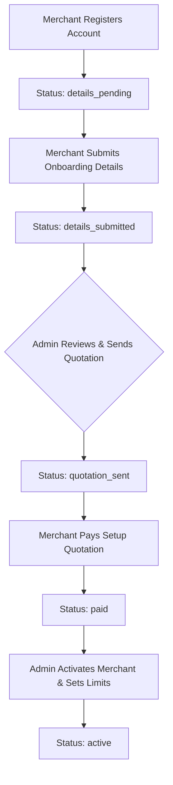
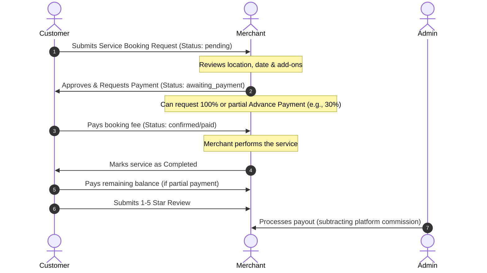

# 🌟 JoyEvents: The Ultimate Event & Service Marketplace Platform

Welcome to **JoyEvents**, a state-of-the-art, dual-sided event and service marketplace platform. JoyEvents is designed to bridge the gap between event organizers/service providers (**Merchants**) and event attendees/clients (**Customers**), all under the structured oversight of platform administrators (**Admins**). 

This document serves as a complete, non-technical and technical guide to understanding what the project is, its features, how it works, and the benefits of each user dashboard. After reading this document, anyone—even someone with zero prior knowledge of the project—will have a crystal-clear understanding of JoyEvents.

---

## 📖 Table of Contents
1. [Project Overview](#-project-overview)
2. [The Dual-Sided Marketplace Concept](#-the-dual-sided-marketplace-concept)
3. [User Roles & Permissions](#-user-roles--permissions)
4. [Step-by-Step Onboarding & Upgrading Workflows](#-step-by-step-onboarding--upgrading-workflows)
5. [The Booking & Payment Lifecycle](#-the-booking--payment-lifecycle)
6. [Detailed Dashboard Breakdown & Benefits](#-detailed-dashboard-breakdown--benefits)
   - [Customer (User) Dashboard](#1-customer-user-dashboard)
   - [Merchant Dashboard](#2-merchant-dashboard)
   - [Admin Dashboard](#3-admin-dashboard)
7. [Technical Stack & Architecture](#-technical-stack--architecture)
8. [Data Models & Relationships](#-data-models--relationships)

---

## 🔍 Project Overview

At its core, **JoyEvents** is a digital ecosystem built to handle everything event-related. 
* Have you ever wanted to buy a ticket to a concert or festival? 
* Do you need to hire a DJ, photographer, or caterer for a wedding? 
* Are you a vendor looking to sell your event planning services or tickets?

JoyEvents handles **both** of these needs in a single, unified web application. It features a stunning dark-mode user interface, real-time database polling, flexible payment terms (full or partial advance payments), a ticket validation system via QR codes, marketing promo tools, automated commission distribution, and personalized AI recommendations.

---

## 🔄 The Dual-Sided Marketplace Concept

JoyEvents divides event bookings into two major categories:

1. **Ticketed Events (B2C - Business to Consumer):**
   * Organizers (Merchants) sell tickets directly to users.
   * Examples: Music festivals, workshops, comedy shows, conferences.
   * Features include multiple ticket tiers (Silver, Gold, Diamond), session management (Day vs. Night), and specific seat allocations.

2. **Full-Service Event Hiring (B2B/B2C - Business to Business/Consumer):**
   * Service providers (Merchants) offer customized event services that clients hire.
   * Examples: Booking a venue, hiring a wedding decorator, booking a live band.
   * Features include custom add-ons, guest capacity specifications, location mapping, and merchant quotation validation.

---

## 👥 User Roles & Permissions

JoyEvents supports three distinct user roles, each with its own workspace and permissions:

### 1. Customer (User)
* **Who they are:** Regular consumers who browse the site to buy event tickets or book service providers.
* **Key Actions:** 
  * Search, browse, and filter events and services by category, date, or location.
  * Add events/services to a personal Favorites list.
  * Book events (selecting ticket tiers, sessions, and seats) or request services (selecting custom add-ons and guest counts).
  * Make secure payments (full or partial advance payment via credit card or mock UPI).
  * Print or download PDF invoices.
  * Chat directly with Merchants via an inbox messaging system.
  * Write ratings and reviews (1-5 stars with comments) upon booking completion.
  * View personalized event suggestions powered by the AI recommendation engine.

### 2. Merchant (Service Provider / Event Organizer)
* **Who they are:** Businesses, planners, caterers, decorators, or entertainers selling their services or ticketed events.
* **Key Actions:**
  * Complete a structured verification onboarding pipeline.
  * Create, edit, and delete events and services (uploading galleries, setting ticket prices, sessions, and seats).
  * Manage customer bookings (Approve, Reject, Update status, Mark complete).
  * Setup customizable advance payment requirements for booking services.
  * Verify customer tickets at live events by typing the Ticket ID or scanning a QR code.
  * Run marketing campaigns by generating custom Promo Codes (discounts) and broadcasting push notifications.
  * Request money withdrawals to their bank account from their cleared earnings.
  * Send/receive chat messages with customers.

### 3. Admin (Platform Administrator)
* **Who they are:** The platform owners/operators who run JoyEvents, verify merchants, configure settings, and handle finances.
* **Key Actions:**
  * Monitor platform-wide metrics (total revenue, user growth, event booking rates).
  * Review merchant onboarding profiles, send onboarding setup quotes, and activate merchant accounts.
  * Handle limit upgrade tickets submitted by merchants who want to host more events or services.
  * Manage global site settings, including modifying the homepage layout (hero titles, stats cards, about us copy).
  * Audit all system transactions, approve/reject bank withdrawal requests, and process payouts.
  * Issue refunds for cancelled or disputed bookings.
  * Moderate and suspend/deactivate users, events, or services that violate policies.

---

## 🚀 Step-by-Step Onboarding & Upgrading Workflows

To maintain platform quality and prevent spam, JoyEvents features strict verification and limits.

### The Merchant Onboarding Pipeline



1. **Details Submission:** The merchant enters their business name, description, address, experience years, and types of services offered.
2. **Admin Review & Quotation:** The admin reviews the profile and issues a customized registration setup fee (quotation).
3. **Payment:** The merchant pays this quotation using a secure card mock layout.
4. **Activation:** The admin sets the merchant's initial listing capabilities (e.g., maximum of 5 active events and 5 active services) and marks the account **Active**.

### Limit Upgrade Ticket System
What happens if a Merchant grows and needs to host more events/services?
1. The merchant raises an **Upgrade Ticket** specifying how many extra slots they need.
2. The admin receives a notification, sets a quotation fee for the upgrade, and sends it back.
3. The merchant pays the quotation.
4. The admin clicks **Approve**, which automatically increases the merchant's slots limits (e.g., upgrading from 5 to 10 events).

---

## 💳 The Booking & Payment Lifecycle

Booking a service is a multi-step negotiation designed to protect both the customer and the merchant.



---

## 📊 Detailed Dashboard Breakdown & Benefits

Let's explore each dashboard, its core sub-sections, and why they are highly beneficial to users.

### 1. Customer (User) Dashboard

| Section / Tab | Key Features | Direct Benefit to the Customer |
| :--- | :--- | :--- |
| **Overview & Stats** | Displays total bookings made, upcoming events, tickets booked, and overall amount spent. | Gives customers a quick, high-level summary of their activity and helps them track event budgets. |
| **My Bookings / Requests** | Lists all ongoing service hire requests and event ticket purchases. Displays status badges (`pending`, `confirmed`, `paid`, etc.). Includes a **Pay Now** button. | Complete transparency over booking statuses. Customers know exactly when merchants accept their requests and can pay securely in a couple of clicks. |
| **Booking History** | Chronological record of completed, rejected, and cancelled bookings. Includes invoices. | Easy access to historical data for personal records, tax reporting, or re-booking. |
| **Invoice Downloader** | Clickable icon that triggers a printable/PDF format invoice with breakdown of prices, taxes, promo discounts, and merchant details. | Professional bookkeeping and proof of payment, generated instantly. |
| **Review & Ratings Hub** | Form allowing users to submit ratings (1 to 5 stars) and write detailed comments for completed events/services. | Empowers customers to share feedback, reward excellent merchants, and help other users make informed decisions. |
| **Browse Events & Services** | Interactive search bar with category pills, location filters, date pickers, and keyword search. | Instant discovery of high-quality local events and professional vendors without leaving the platform. |
| **Favorites / Wishlist** | Bookmark button on event cards to save listings for later. | Users can build custom lists of event ideas or preferred suppliers, making planning fast and organized. |
| **AI Recommendations** | Dynamic section displaying personalized events scored based on the customer's purchase history and matching categories. | Exposes customers to new, relevant experiences they are highly likely to enjoy, customized automatically. |
| **Settings & Profile** | Edit personal profile, contact information, profile picture, change password. | Secure control over personal data and login credentials. |

---

### 2. Merchant Dashboard

| Section / Tab | Key Features | Direct Benefit to the Merchant |
| :--- | :--- | :--- |
| **Onboarding Workspace** | Multi-step interactive panel showing verification steps, quotation status, and billing details. | Clear, guided path to get verified. Ensures merchants understand the rules and setup fees upfront. |
| **Business Overview** | High-level widgets showing Monthly Earnings, Total Completed Bookings, Active Event listings, and Active Service listings. | Provides a financial pulse of the merchant's business immediately upon logging in. |
| **Order Management** | Actionable table of client requests. Buttons: **Approve** (with options for Full vs. Custom Advance payment), **Reject** (with reason input), **Update Status** (e.g. Processing, Awaiting Final Payment), and **Mark Complete**. | Gives merchants absolute control over their schedule. They can filter out bad requests, require deposits to secure dates, and update clients in real-time. |
| **Event & Service Creators** | Detailed forms for creating ticketed events or hiring services. Supports day/night sessions, custom pricing per ticket tier, seating maps, maximum guest counts, custom service add-ons, and photo upload. | Flexibly accommodates any business model, whether selling festival tickets or booking wedding photography packages. |
| **Live Events Monitor** | Dashboard displaying events happening now. Shows ticket breakdown (VIP vs. Regular, Day vs. Night session), attendees registered, and real-time validation statistics. | Essential for day-of operations. Helps staff manage crowds, track check-ins, and spot check ticket statistics. |
| **Ticket Validation (QR/ID)** | Input field to search Ticket IDs or trigger the camera to scan a QR code. Instantly checks ticket validity and registers the check-in time. | Prevents ticket fraud or double-entries, speeding up gate lines at events. |
| **Earnings & Withdrawals** | Balance tracker (Available Balance vs. Pending Payouts). Form to request withdrawals by entering bank name, account number, account holder, and IFSC code. Lists transaction history. | Secure, transparent path to get paid. Merchants can audit exactly how much commission was taken and when their funds will hit their bank. |
| **Marketing Tools** | **Promo Codes Creator** (set code name, discount % or flat cash, minimum booking rules, maximum use limits, expiry dates). **Push Notification Broadcasts** (send custom message templates directly to all client notifications). | Boosts sales. Merchants can launch flash sales, run seasonal discounts, and re-engage customers directly. |
| **QR Code Generator** | Generates high-quality QR codes linked to the merchant's public profile or specific events. | Enhances offline-to-online marketing. Can be printed on flyers, posters, or shared on social media. |
| **AI Insights** | Tailored reach metrics estimating how many views their events got, potential customer base matching, and recommendations on how to boost listing visibility. | Data-driven coaching that helps merchants optimize listing prices, categories, and event schedules to make more money. |

---

### 3. Admin Dashboard

| Section / Tab | Key Features | Direct Benefit to the Admin |
| :--- | :--- | :--- |
| **Admin Overview & Stats** | Global KPI counter: Platform Revenue, Active Users, Active Events, Completed Bookings. | Instant assessment of platform growth, volume, health, and total commission generated. |
| **Merchant Onboarding Hub** | Queue of submitted merchant applications. Controls to view business addresses, send customized pricing quotes, and activate accounts with slot limits. | Complete control over who sells on the platform. Protects the brand from fraudulent merchants. |
| **Limit Upgrades Desk** | Table of limit upgrade tickets raised by active merchants. Send quotation options, review pay logs, and approve slot upgrades. | Monopolizes and monetizes platform scalability. Encourages high-performing merchants to upgrade their tiers. |
| **Commissions Manager** | Inputs to adjust the global commission percentage (e.g., changing platform cut from 10% to 12%). Logs historical commission rate changes. | Admin can optimize platform monetization dynamically based on seasonal metrics or operating costs. |
| **Payouts & Withdrawals Desk** | Table of merchant bank cashout requests. Action buttons to mark as processed (and input bank txn reference number) or reject with an explanation. | Safe financial processing. Admins can verify bank details before releasing funds, protecting against fraud. |
| **Refunds & Disputes Desk** | Queue of bookings requesting refunds. Displays original amount, payment method, refund reason. Button to process refund. | Resolves disputes quickly. Admins can act as intermediate arbitrators between customers and merchants. |
| **User & Audit Trail Desk** | Database viewer of all registered users (Admins, Merchants, Customers). Actions: View profiles, review sign-up times, and **Deactivate / Activate** user accounts instantly. | Handles security issues, bans bad actors, and deactivates accounts instantly, logging them out of active sessions. |
| **Homepage Layout Editor** | Configurator form to modify frontend homepage values: hero text titles, marketing subtitles, dynamic stat counters, working hours, and social media handles. | Eliminates code updates. Allows marketing admins to change site messaging, phone numbers, or addresses instantly without developer assistance. |
| **AI Platform Analytics** | Charts indicating platform recommendation hits, top-performing categories, and user search trend logs. | Helps admins see what event types are trending, guiding future marketing campaigns and merchant outreach. |

---

## 🛠 Technical Stack & Architecture

JoyEvents is structured as a modern, high-performance web application:

### Frontend Technologies
* **React (Vite + TypeScript):** Fast, type-safe development environment with optimized builds.
* **TailwindCSS & Shadcn UI:** Sleek, fully responsive layouts using premium, dark-themed styling.
* **Framer Motion:** Micro-animations and smooth transition effects.
* **TanStack Query & Axios:** Efficient API state synchronization and asynchronous caching.
* **React-Router-Dom:** Smooth Client-Side Routing with protected page guards based on user roles (`customer`, `merchant`, `admin`).
* **i18next:** Integrated multi-language labels support (translation framework).

### Backend Technologies
* **Node.js & Express:** Scalable, lightweight REST API server.
* **MongoDB & Mongoose:** NoSQL database representing events, services, tickets, and user accounts.
* **JWT (JSON Web Tokens):** Secure, stateless authentication system using authorization headers.
* **Nodemailer:** Automated SMTP email integration for password reset notifications.

### Production & Hosting Readiness
* **Docker:** Multi-stage Dockerfiles for both frontend and backend compilation.
* **PM2 / Ecosystem Configurations:** Handles clustering and auto-restarts for continuous server uptime.
* **Nginx configuration:** Ready for proxying API requests and serving static single-page application (SPA) paths.

---

## 🗄 Data Models & Relationships

JoyEvents organizes database logic through several key entities in MongoDB:

```
                  ┌──────────────┐
                  │     User     │
                  └──────┬───────┘
                         │ 1
                         │
         ┌───────────────┼───────────────┐
         │ 1             │ 1             │ 1
 ┌───────▼───────┐ ┌─────▼─────────┐ ┌───▼───────────┐
 │     Event     │ │    Service    │ │    Ticket     │ (Upgrade Ticket)
 └───────┬───────┘ └─────┬─────────┘ └───────────────┘
         │ 1             │ 1
         │               │
         └───────┬───────┘
                 │ 1:Many
         ┌───────▼───────┐
         │    Booking    │
         └───────┬───────┘
                 │ 1
         ┌───────▼───────┐
         │  Transaction  │ (Payment logs)
         └───────────────┘
```

1. **User (`User.js`):** Contains names, credentials, role configurations (`customer`, `merchant`, `admin`), merchant status flags, maximum event/service slot limits, and profile details.
2. **Event (`Event.js`):** Tracks titles, locations, datetime, pricing, ticket tiers (Silver/Gold/Diamond), Day/Night session availabilities, booked seats, and creator references.
3. **Service (`Service.js`):** Defines hireable services, guest caps, highlights list, custom add-ons, and pricing.
4. **Booking (`Booking.js`):** The core transaction ledger. Tracks who booked what, the price, status (`pending`, `confirmed`, `paid`, `completed`, etc.), payment type (`full` vs `advance`), seat layouts, custom add-on list, and rating review snapshots.
5. **Ticket (`Ticket.js`):** Handles merchant request records for limit upgrades, tracking request sizes, quotes, and payment statuses.
6. **Transaction (`Transaction.js`):** Audit log of every card/UPI transaction completed on the platform.
7. **Withdrawal (`Withdrawal.js`):** Records payouts requested by merchants, bank accounts, and approval status.
8. **PromoCode (`PromoCode.js`):** Defines discount metrics used by merchants to incentivize bookings.
9. **Settings (`Settings.js`):** Storage for platform settings, homepage banners, and global commission rates.
